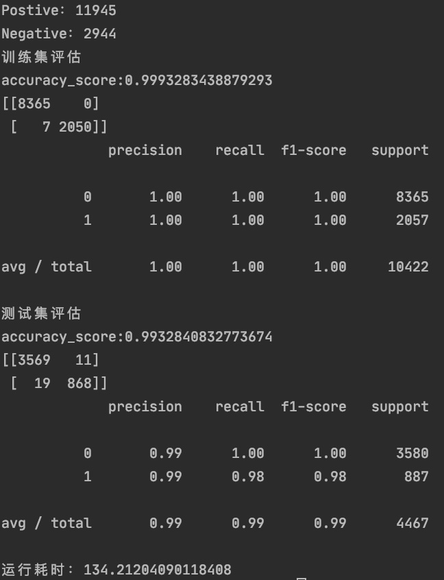

# webshellDc v0.1

webshell通常是指利用asp、jsp、php、py、pl脚本语言编写，对web服务器进行管理的工具，也叫webadmin。webshell可以用来上传下载文件，查看数据库，系统命令调用，因此常被黑客利用并对服务器进行一系列入侵操作，具备威胁大、隐蔽性强等特点。


本项目分别收集了160个Github项目的webshell黑样本和大量个开源php、jsp、asp、java项目作为白样本，去重后黑样本2944个，白样本11945个，采用CountVectorizer和TfidfTransformer对n-gram后的样本进行特征向量处理，分别采用多层神经网络、XGBoost、朴素贝叶斯进行训练。其中MLPClassifier模型表现较好。


## 使用方式
```
训练：
python train.py -n webshelldir(黑样本文件路径) -p normaldir(白样本文件路径) -m mlp(模型选项)

测试：
python webshellDc.py
```


## 训练环境 

>系统：macOS 16 GB + python 3.6.3
>执行时间：134s


## 运行截图 



## 联系方式

作者：月亮与六便士
微信：326356198


白名单检测：
检测总量:11945, 检测出webshell:23, 检测出正常文件:11922
误报率：0.0019254918375889493

黑名单检测：
检测总量:2944, 检测出webshell:2925, 检测出正常文件:19
召回率：0.993546195652174


## 黑样本 

https://github.com/tennc/webshell  
https://github.com/ysrc/webshell-sample
https://github.com/xl7dev/WebShell
https://github.com/tdifg/WebShell
https://github.com/fictivekin/webshell
https://github.com/bartblaze/PHP-backdoors
https://github.com/malwares/WebShell
https://github.com/xypiie/WebShell
https://github.com/testsecer/WebShell
https://github.com/nbs-system/php-malware-finder
https://github.com/BlackArch/webshells
https://github.com/tanjiti/webshellSample
https://github.com/dotcppfile/DAws
https://github.com/theralfbrown/webshell
https://github.com/gokyle/webshell
https://github.com/sunnyelf/cheetah
https://github.com/JohnTroony/php-webshells
https://github.com/evilcos/python-webshell
https://github.com/lhlsec/webshell
https://github.com/shewey/webshell
https://github.com/boy-hack/WebshellManager
https://github.com/liulongfei/web_shell_bopo
https://github.com/Ni7eipr/webshell
https://github.com/WangYihang/Webshell-Sniper
https://github.com/pm2-hive/pm2-webshell
https://github.com/samdark/yii2-webshell
https://github.com/b1ueb0y/webshell
https://github.com/oneoneplus/webshell
https://github.com/zhaojh329/xterminal
https://github.com/juanparati/Webshell
https://github.com/wofeiwo/webshell-find-tools
https://github.com/abcdlzy/webshell-manager
https://github.com/alert0/webshellch
https://github.com/needle-wang/jweevely
https://github.com/tengzhangchao/PyCmd
https://github.com/0x73686974/WebShell
https://github.com/wonderqs/Blade
https://github.com/le4f/aspexec
https://github.com/jijinggang/WebShell
https://github.com/matiasmenares/Shuffle
https://github.com/Skycrab/PySpy
https://github.com/huge818/webshell
https://github.com/gb-sn/go-webshell
https://github.com/BlackHole1/Fastener
https://github.com/blackhalt/WebShells
https://github.com/tomas1000r/webshell
https://github.com/hanzhibin/Webshell
https://github.com/decebel/webShell
https://github.com/Aviso-hub/Webshell
https://github.com/vnhacker1337/Webshell
https://github.com/bittorrent3389/Webshell
https://github.com/anhday22/WebShell
https://github.com/buxiaomo/webshell
https://github.com/z3robat/webshell
https://github.com/n3oism/webshell
https://github.com/uuleaf/WebShell
https://github.com/onefor1/webshell
https://github.com/cunlin-yu/webshell
https://github.com/roytest1/webshell
https://github.com/backlion/webshell
https://github.com/opetrovski/webshell
https://github.com/opetrovski/webshell
https://github.com/gsmlg/webshell
https://github.com/health901/webshell
https://github.com/inof8r/WebShell
https://github.com/Najones19746/webShell
https://github.com/RaspiCar/WebShell
https://github.com/health901/webshell
https://github.com/dinamsky/WebShell
https://github.com/Fay48/WebShell
https://github.com/tuz358/webshell
https://github.com/shajf/Webshell
https://github.com/t17lab/WebShell
https://github.com/blacksunwen/webshell
https://github.com/webshellarchive/webshellco
https://github.com/lolwaleet/Rubshell
https://github.com/WhiteWinterWolf/WhiteWinterWolf-php-webshell
https://github.com/goodtouch/jruby-webshell
https://github.com/maestrano/webshell-server
https://github.com/LuciferoO/webshell-collector
https://github.com/wangeradd1/myWebShell
https://github.com/0xHJK/caidao
https://github.com/alintamvanz/1945shell
https://github.com/Venen0/vshell
https://github.com/lojikil/tinyshell
https://github.com/wso-shell/PHP-SHELL-WSO
https://github.com/meme-lord/PHPShellBackdoors
https://github.com/Learn2Better/51mp3L-Web-Backdoor
https://github.com/yuxiaokui/JBoss-Hack
https://github.com/SecurityRiskAdvisors/cmd.jsp
https://github.com/ddcunningham/crude-shellhunter
https://github.com/stormdark/BackdoorPHP
https://github.com/vduddu/Malware
https://github.com/1oid/BurstPHPshell
https://github.com/gokyle/urlshorten_ng
https://github.com/rhelsing/trello_osx
https://github.com/pfrazee/wsh-grammar
https://github.com/x-o-r-r-o/PHP-Webshells-Collection
https://github.com/IHA114/WebShell2
https://github.com/WangYihang/WebShellCracker
https://github.com/KINGSABRI/WebShellConsole
https://github.com/jujinesy/webshells.17.03.18
https://github.com/hackzsd/HandyShells
https://github.com/mperlet/pomsky
https://github.com/cybernoir/bns-php-shell
https://github.com/XianThi/rexShell
https://github.com/H4CK3RT3CH/php-webshells
https://github.com/minisllc/subshell
https://github.com/linuxsec/indoxploit-shell
https://github.com/kuniasahi/mpshell
https://github.com/datasiph0n/MyBB-Shell-Plugin
https://github.com/magicming200/evil-koala-php-webshell
https://github.com/0xK3v/Simple-WebShell
https://github.com/djoq/docker-pm2-webshell
https://github.com/SMRUCC/GCModeller.WebShell
https://github.com/darknesstiller/WebShells
https://github.com/devilscream/remoteshell
https://github.com/0verl0ad/gorosaurus
https://github.com/grCod/poly
https://github.com/cryptobioz/wizhack
https://github.com/amwso/docker-webshell
https://github.com/William-Hunter/JSP_Webshell
https://github.com/yangbaopeng/ashx_webshell
https://github.com/webshellpub/awsome-webshell
https://github.com/noalh8t/simple-webshell
https://github.com/s3cureshell/wso-2.8-web-shell
https://github.com/LiamRandall/simpleexec
https://github.com/Samorodek/humhub-modules-webshell
https://github.com/mwambler/webshell-xpages-ext-lib
https://github.com/AVGP/Wesh
https://github.com/edibledinos/weevely3-stealth
https://github.com/lehins/haskell-webshell
https://github.com/guglia001/php-secure-remove
https://github.com/gokyle/webshell_tutorial
https://github.com/azmanishak/webshell-php
https://github.com/andrefernandes/docker-webshell
https://github.com/codehz/node-webshell
https://github.com/koolshare/merlin-webshell
https://github.com/StephaneP/erl-webshell
https://github.com/jjjmaracay3/webshells
https://github.com/grCod/webshells
https://github.com/ian4hu/bootshell
https://github.com/Ghostboy-287/wso-webshell
https://github.com/xiaoxiaoleo/xiao-webshell
https://github.com/alexbires/webshellmanagement
https://github.com/codeT/collectWebShell
https://github.com/PhilCodeEx/jak3fr0z
https://github.com/Ettack/WebshellCCL
https://github.com/jubal-R/TinyWebShell
https://github.com/CaledoniaProject/AxisInvoker
https://github.com/theBrianCui/ISSS_webShell
https://github.com/webshell/webshell-node-sdk
https://github.com/Medicean/AS_BugScan
https://github.com/3xp10it/xwebshell
https://github.com/niemand-sec/RazorSyntaxWebshell
https://github.com/LuciferoO/webshell-collector
https://github.com/0verl0ad/HideShell
https://github.com/L-codes/oneshellcrack
https://github.com/ArchAssault-Project/webshells
https://github.com/AndrHacK/andrshell
